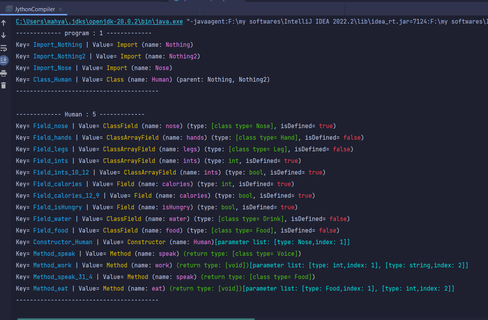
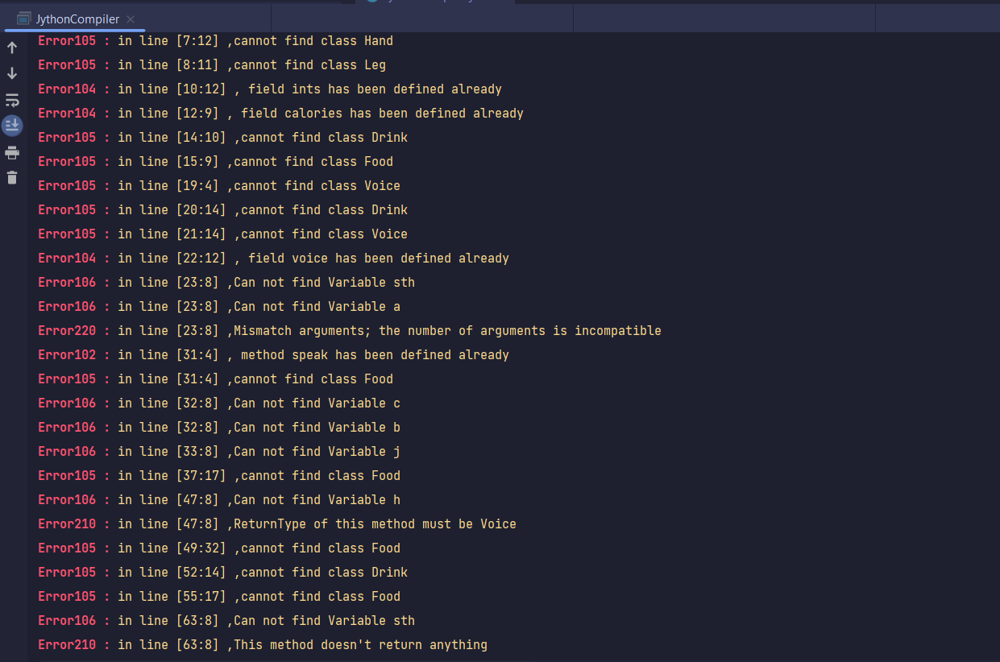

# Jython Compiler
 A Java program to implement a simple compiler for Jython language.

### Creators
- [mahya.ehsanimehr@gmail.com](mailto:mahya.ehsanimehr@gmail.com)
- [bita.karvizi1379@gmail.com](bita.karvizi1379@gmail.com)

## Overview
The Jython Compiler is a Java-based tool designed to compile and execute Jython code seamlessly. Jython language is a mix of Python and Java. We developed this project as a part of the **Compiler Design** course. 
First, we pass a test case, a Jython code snippet, to the code. Then the parse tree of code is generated using ParseTreeWalker in Java. The rest of the work is done by `MyJythonListener` class. This class detects all parts of the code including class name, parent, variables, functions etc using ctx. Finally, the errors of the code are detected and printed in the output.

## Results
This is how the ouput of our code looks for the `input.txt` test case.

**showing structutres of the testcase**

**showing errors of the testcase**

## License
This project is licensed under the MIT License - see the [LICENSE](LICENSE) file for details.

